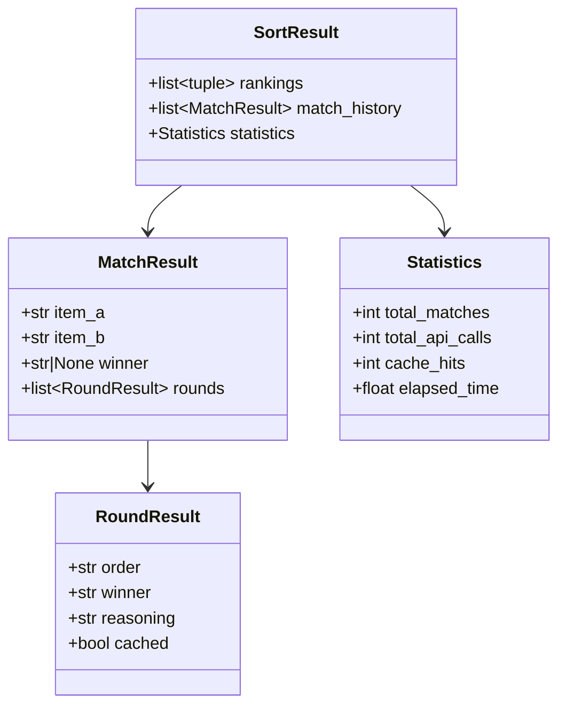
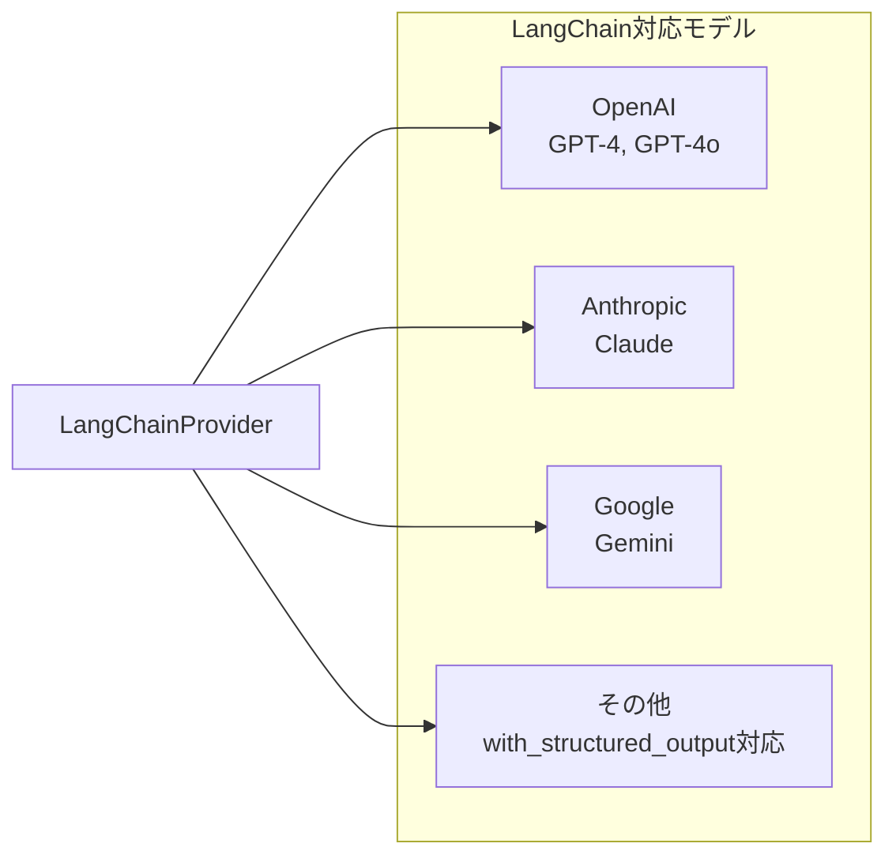
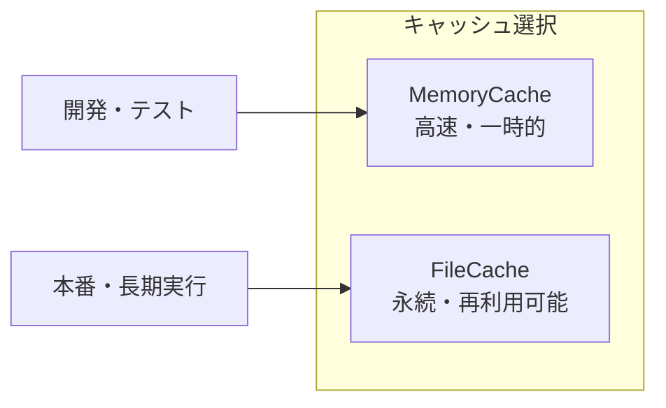
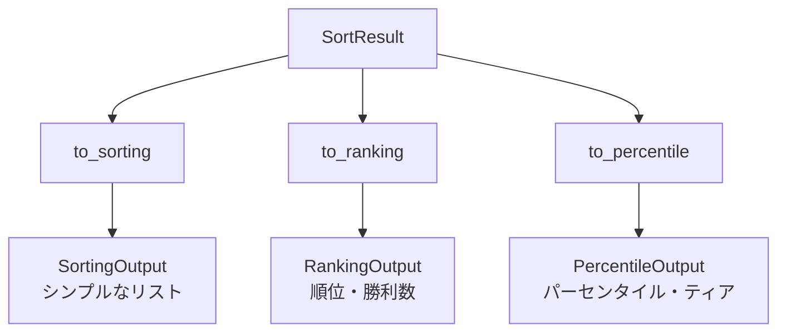
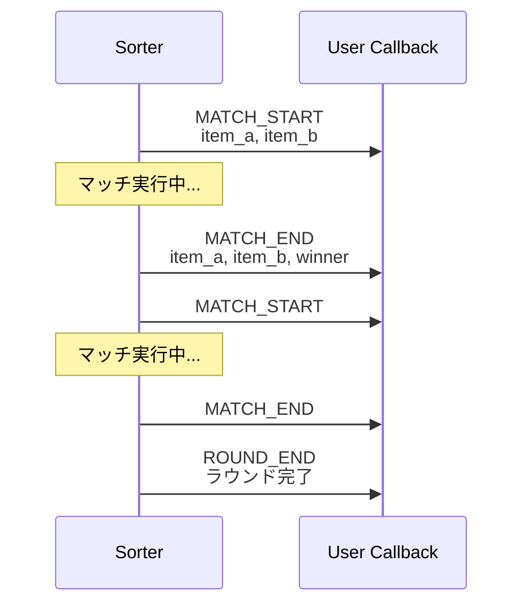

# API リファレンス

## クイックスタート

```python
import asyncio
from langchain_openai import ChatOpenAI
from llm_qualitative_sort import (
    QualitativeSorter,
    LangChainProvider,
    MemoryCache,
    to_ranking,
)

async def main():
    # LLMプロバイダーの設定
    model = ChatOpenAI(model="gpt-4o-mini")
    provider = LangChainProvider(model)

    # ソーターの作成
    sorter = QualitativeSorter(
        provider=provider,
        criteria="文章の品質と読みやすさ",
        elimination_count=2,
        cache=MemoryCache(),
    )

    # ソート実行
    items = ["文章A", "文章B", "文章C", "文章D"]
    result = await sorter.sort(items)

    # 結果表示
    ranking = to_ranking(result)
    for entry in ranking.entries:
        print(f"{entry.rank}位: {entry.item} ({entry.wins}勝)")

asyncio.run(main())
```

## コアクラス

### QualitativeSorter

メインのソータークラス。

```python
class QualitativeSorter:
    def __init__(
        self,
        provider: LLMProvider,
        criteria: str,
        elimination_count: int = 2,
        comparison_rounds: int = 2,
        max_concurrent_requests: int = 10,
        cache: Cache | None = None,
        on_progress: Callable[[ProgressEvent], None] | None = None,
        seed: int | None = None,
    ) -> None: ...

    async def sort(self, items: list[str]) -> SortResult: ...
```

#### パラメータ

| パラメータ | 型 | デフォルト | 説明 |
|-----------|------|-----------|------|
| `provider` | `LLMProvider` | 必須 | LLMプロバイダー |
| `criteria` | `str` | 必須 | 評価基準 |
| `elimination_count` | `int` | 2 | 脱落に必要な敗北数 |
| `comparison_rounds` | `int` | 2 | 1マッチあたりのラウンド数 |
| `max_concurrent_requests` | `int` | 10 | 最大同時リクエスト数 |
| `cache` | `Cache \| None` | None | キャッシュインスタンス |
| `on_progress` | `Callable` | None | 進捗コールバック |
| `seed` | `int \| None` | None | 乱数シード |

## データモデル

### SortResult

ソート結果を格納するデータクラス。

```python
@dataclass
class SortResult:
    rankings: list[tuple[int, list[str]]]  # [(順位, [アイテム]), ...]
    match_history: list[MatchResult]        # マッチ履歴
    statistics: Statistics                   # 統計情報
```



### ComparisonResult

単一の比較結果。

```python
@dataclass
class ComparisonResult:
    winner: str | None  # "A", "B", or None (エラー時)
    reasoning: str      # 判定理由
    raw_response: dict  # 生のLLMレスポンス
```

## LLMプロバイダー

### LLMProvider（基底クラス）

```python
class LLMProvider(ABC):
    @abstractmethod
    async def compare(
        self,
        item_a: str,
        item_b: str,
        criteria: str,
    ) -> ComparisonResult: ...
```

### LangChainProvider

LangChainの`BaseChatModel`を使用するプロバイダー。

```python
class LangChainProvider(LLMProvider):
    def __init__(self, model: BaseChatModel) -> None: ...
```

#### 対応モデル



#### 使用例

```python
# OpenAI
from langchain_openai import ChatOpenAI
provider = LangChainProvider(ChatOpenAI(model="gpt-4o"))

# Anthropic
from langchain_anthropic import ChatAnthropic
provider = LangChainProvider(ChatAnthropic(model="claude-3-5-sonnet-20241022"))

# Google
from langchain_google_genai import ChatGoogleGenerativeAI
provider = LangChainProvider(ChatGoogleGenerativeAI(model="gemini-1.5-flash"))
```

### MockLLMProvider

テスト用のモックプロバイダー。数値文字列を比較します。

```python
class MockLLMProvider(LLMProvider):
    def __init__(
        self,
        noise_stddev: float = 3.33,
        seed: int | None = None,
    ) -> None: ...
```

## キャッシュ

### Cache（基底クラス）

```python
class Cache(ABC):
    @abstractmethod
    async def get(
        self,
        item_a: str,
        item_b: str,
        criteria: str,
        order: str,
    ) -> ComparisonResult | None: ...

    @abstractmethod
    async def set(
        self,
        item_a: str,
        item_b: str,
        criteria: str,
        order: str,
        result: ComparisonResult,
    ) -> None: ...
```

### MemoryCache

メモリ上のキャッシュ（セッション限定）。

```python
class MemoryCache(Cache):
    def __init__(self) -> None: ...
```

### FileCache

ファイルベースの永続キャッシュ。

```python
class FileCache(Cache):
    def __init__(self, cache_dir: str) -> None: ...
```



## 出力フォーマッター

### to_sorting

シンプルなソート済みリストを返します。

```python
def to_sorting(result: SortResult) -> SortingOutput: ...

@dataclass
class SortingOutput:
    items: list[str]  # ソート済みアイテム
```

### to_ranking

詳細なランキング情報を返します。

```python
def to_ranking(result: SortResult) -> RankingOutput: ...

@dataclass
class RankingEntry:
    rank: int
    item: str
    wins: int
    is_tied: bool

@dataclass
class RankingOutput:
    entries: list[RankingEntry]
    total_items: int
```

### to_percentile

パーセンタイルとティア分類を返します。

```python
def to_percentile(
    result: SortResult,
    tier_thresholds: dict[str, float] | None = None,
) -> PercentileOutput: ...

@dataclass
class PercentileEntry:
    item: str
    percentile: float  # 0.0-100.0
    rank: int
    tier: str          # S/A/B/C/D

@dataclass
class PercentileOutput:
    entries: list[PercentileEntry]
    total_items: int
```



#### デフォルトティア閾値

| ティア | パーセンタイル範囲 |
|--------|-------------------|
| S      | 90-100            |
| A      | 70-89             |
| B      | 50-69             |
| C      | 30-49             |
| D      | 0-29              |

## イベントシステム

### EventType

```python
class EventType(Enum):
    MATCH_START = "match_start"  # マッチ開始
    MATCH_END = "match_end"      # マッチ終了
    ROUND_END = "round_end"      # ラウンド終了
```

### ProgressEvent

```python
@dataclass
class ProgressEvent:
    type: EventType
    message: str
    completed: int  # 完了マッチ数
    total: int      # 推定総マッチ数
    data: dict | None
```

### 使用例

```python
def on_progress(event: ProgressEvent):
    pct = (event.completed / event.total) * 100
    print(f"[{pct:.1f}%] {event.message}")

    if event.type == EventType.MATCH_END:
        winner = event.data.get("winner", "引き分け")
        print(f"  → 勝者: {winner}")

sorter = QualitativeSorter(..., on_progress=on_progress)
```



## メトリクス

### AccuracyMetrics

```python
@dataclass
class AccuracyMetrics:
    kendall_tau: float        # ケンドールのタウ係数 (-1〜1)
    top_10_accuracy: float    # Top10精度
    top_50_accuracy: float    # Top50精度
    top_100_accuracy: float   # Top100精度
    correct_pair_ratio: float # 正しいペア比率
```

### 計算関数

```python
def calculate_kendall_tau(actual: list[str], expected: list[str]) -> float: ...
def calculate_top_k_accuracy(actual: list[str], expected: list[str], k: int) -> float: ...
def calculate_correct_pair_ratio(actual: list[str], expected: list[str]) -> float: ...
def calculate_all_metrics(actual: list[str], expected: list[str]) -> AccuracyMetrics: ...
```

### 使用例

```python
from llm_qualitative_sort import calculate_all_metrics, to_sorting

result = await sorter.sort(items)
sorted_items = to_sorting(result).items

# 期待される順序がある場合
expected = ["best", "good", "ok", "bad"]
metrics = calculate_all_metrics(sorted_items, expected)

print(f"Kendall's Tau: {metrics.kendall_tau:.3f}")
print(f"Correct Pair Ratio: {metrics.correct_pair_ratio:.1%}")
```

## 完全な使用例

```python
import asyncio
from langchain_openai import ChatOpenAI
from llm_qualitative_sort import (
    QualitativeSorter,
    LangChainProvider,
    FileCache,
    ProgressEvent,
    EventType,
    to_ranking,
    to_percentile,
)

def progress_handler(event: ProgressEvent):
    if event.type == EventType.MATCH_END:
        print(f"[{event.completed}/{event.total}] {event.message}")

async def main():
    # 設定
    model = ChatOpenAI(model="gpt-4o-mini", temperature=0)
    provider = LangChainProvider(model)
    cache = FileCache("./cache")

    sorter = QualitativeSorter(
        provider=provider,
        criteria="キャラクターの強さ（戦闘能力、特殊能力、知略を総合的に評価）",
        elimination_count=3,
        comparison_rounds=2,
        max_concurrent_requests=5,
        cache=cache,
        on_progress=progress_handler,
        seed=42,
    )

    # ソート対象
    characters = [
        "孫悟空（ドラゴンボール）",
        "ルフィ（ワンピース）",
        "ナルト（NARUTO）",
        "一護（BLEACH）",
    ]

    # 実行
    result = await sorter.sort(characters)

    # ランキング出力
    print("\n=== ランキング ===")
    ranking = to_ranking(result)
    for entry in ranking.entries:
        tie = "（同率）" if entry.is_tied else ""
        print(f"{entry.rank}位: {entry.item} - {entry.wins}勝{tie}")

    # パーセンタイル出力
    print("\n=== ティア分類 ===")
    percentile = to_percentile(result)
    for entry in percentile.entries:
        print(f"[{entry.tier}] {entry.item} ({entry.percentile:.1f}%)")

    # 統計
    print(f"\n=== 統計 ===")
    stats = result.statistics
    print(f"総マッチ数: {stats.total_matches}")
    print(f"API呼び出し: {stats.total_api_calls}")
    print(f"キャッシュヒット: {stats.cache_hits}")
    print(f"実行時間: {stats.elapsed_time:.2f}秒")

asyncio.run(main())
```
