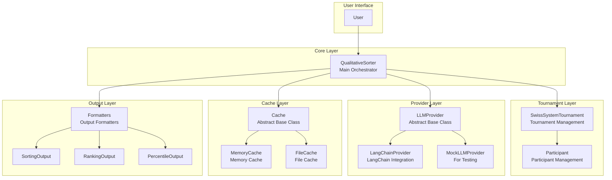
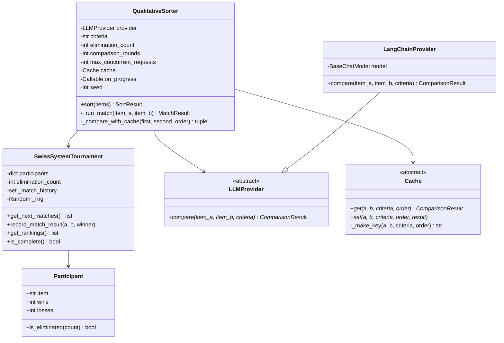
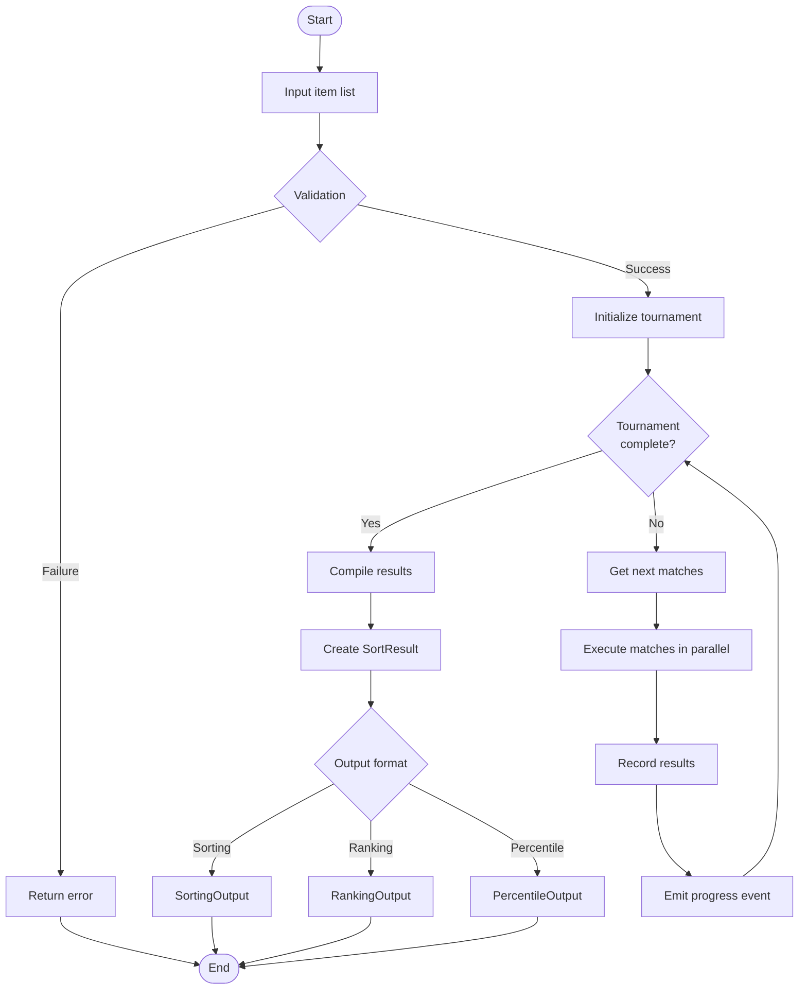

# LLM Qualitative Sort - Architecture Document

[日本語版](architecture.ja.md)

## Overview

**llm-qualitative-sort** is a Python package that sorts text data based on qualitative criteria using LLMs (Large Language Models).

Using a Swiss-system tournament format, it ranks multiple items based on evaluation criteria that cannot be quantitatively compared, such as "writing quality" or "character strength."

## System Architecture



## Component Structure



## Data Flow



## Key Components

### 1. QualitativeSorter

Main orchestrator class. Integrates all components and controls the entire sorting process.

**Responsibilities:**
- Item validation
- Tournament execution control
- Concurrent request limiting (Semaphore)
- Progress event emission
- Result aggregation

### 2. SwissSystemTournament

Implements Swiss-system tournament logic.

**Responsibilities:**
- Participant management (win/loss tracking)
- Bracket (loss count group) matching
- Match history tracking
- Final ranking calculation

### 3. LLMProvider

Interface abstracting LLM communication.

**Implementations:**
- `LangChainProvider`: Generic provider using LangChain
- `MockLLMProvider`: Mock provider for testing

### 4. Cache

Caches comparison results to prevent redundant LLM calls.

**Implementations:**
- `MemoryCache`: In-memory cache (session-limited)
- `FileCache`: File-based persistent cache

## Design Principles

### Dependency Injection

```python
# Provider and cache are injected externally
sorter = QualitativeSorter(
    provider=LangChainProvider(model),  # Injected
    criteria="Text quality",
    cache=FileCache("./cache"),          # Injected
)
```

### Async Processing

All LLM calls use `async/await`, with `asyncio.Semaphore` controlling concurrent request count.

```python
async with self._semaphore:
    result = await self._provider.compare(first, second, self._criteria)
```

### Event-Driven Progress Reporting

```python
def on_progress(event: ProgressEvent):
    print(f"{event.completed}/{event.total}: {event.message}")

sorter = QualitativeSorter(..., on_progress=on_progress)
```

## File Structure

```
src/llm_qualitative_sort/
├── __init__.py              # Public API
├── models.py                # Data structures
├── events.py                # Event system
├── sorter.py                # Main class
├── metrics.py               # Evaluation metrics
├── providers/               # LLM providers
│   ├── base.py             # Abstract base class
│   ├── langchain.py        # LangChain integration
│   ├── mock.py             # For testing
│   └── errors.py           # Error handling
├── tournament/              # Tournament processing
│   └── swiss_system.py
├── cache/                   # Cache functionality
│   └── __init__.py
└── output/                  # Output formatting
    ├── models.py
    ├── formatters.py
    └── calculators.py
```
