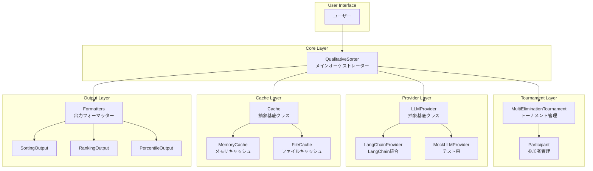
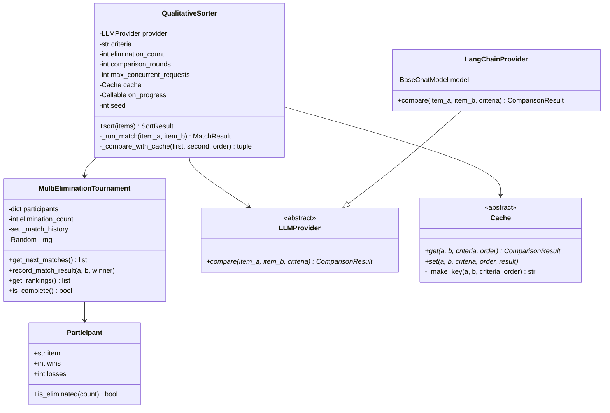
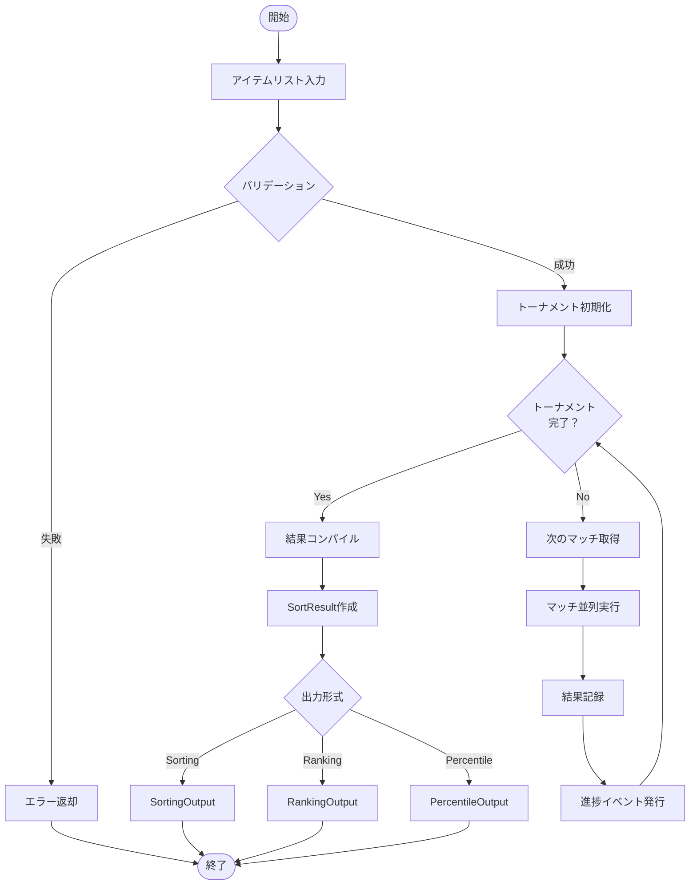

# LLM Qualitative Sort - アーキテクチャドキュメント

## 概要

**llm-qualitative-sort** は、LLM（大規模言語モデル）を用いて定性的な基準でテキストデータをソートするPythonパッケージです。

マルチイリミネーショントーナメント方式を採用し、「文章の良さ」「キャラクターの強さ」など、定量的に比較できない評価観点に基づいて複数の項目を順位付けします。

## システムアーキテクチャ



## コンポーネント構成



## データフロー



## 主要コンポーネント

### 1. QualitativeSorter

メインオーケストレータークラス。すべてのコンポーネントを統合し、ソート処理全体を制御します。

**責務:**
- アイテムのバリデーション
- トーナメントの実行制御
- 並行リクエストの制限（Semaphore）
- 進捗イベントの発行
- 結果の集計

### 2. MultiEliminationTournament

マルチイリミネーション方式のトーナメントロジックを実装します。

**責務:**
- 参加者の管理（勝敗記録）
- ブラケット（敗北数グループ）によるマッチング
- 対戦履歴の追跡
- 最終順位の算出

### 3. LLMProvider

LLMとの通信を抽象化したインターフェース。

**実装:**
- `LangChainProvider`: LangChainを使用した汎用プロバイダー
- `MockLLMProvider`: テスト用のモックプロバイダー

### 4. Cache

比較結果をキャッシュし、重複したLLM呼び出しを防ぎます。

**実装:**
- `MemoryCache`: メモリ上のキャッシュ（セッション限定）
- `FileCache`: ファイルベースの永続キャッシュ

## 設計原則

### 依存性注入

```python
# プロバイダーとキャッシュは外部から注入
sorter = QualitativeSorter(
    provider=LangChainProvider(model),  # 注入
    criteria="文章の品質",
    cache=FileCache("./cache"),          # 注入
)
```

### 非同期処理

すべてのLLM呼び出しは `async/await` を使用し、`asyncio.Semaphore` で同時リクエスト数を制御します。

```python
async with self._semaphore:
    result = await self._provider.compare(first, second, self._criteria)
```

### イベント駆動の進捗報告

```python
def on_progress(event: ProgressEvent):
    print(f"{event.completed}/{event.total}: {event.message}")

sorter = QualitativeSorter(..., on_progress=on_progress)
```

## ファイル構成

```
src/llm_qualitative_sort/
├── __init__.py              # パブリックAPI
├── models.py                # データ構造
├── events.py                # イベントシステム
├── sorter.py                # メインクラス
├── metrics.py               # 評価メトリクス
├── providers/               # LLMプロバイダー
│   ├── base.py             # 抽象基底クラス
│   ├── langchain.py        # LangChain統合
│   ├── mock.py             # テスト用
│   └── errors.py           # エラーハンドリング
├── tournament/              # トーナメント処理
│   └── multi_elimination.py
├── cache/                   # キャッシュ機能
│   └── __init__.py
└── output/                  # 出力フォーマット
    ├── models.py
    ├── formatters.py
    └── calculators.py
```
