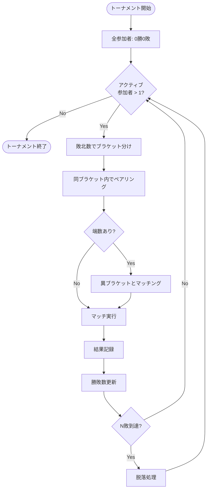
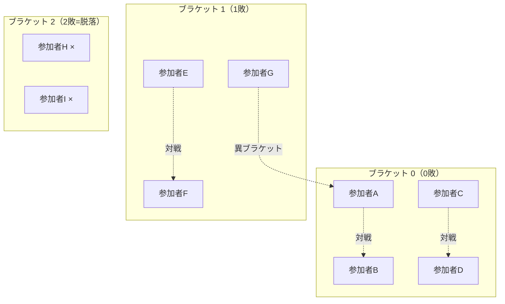
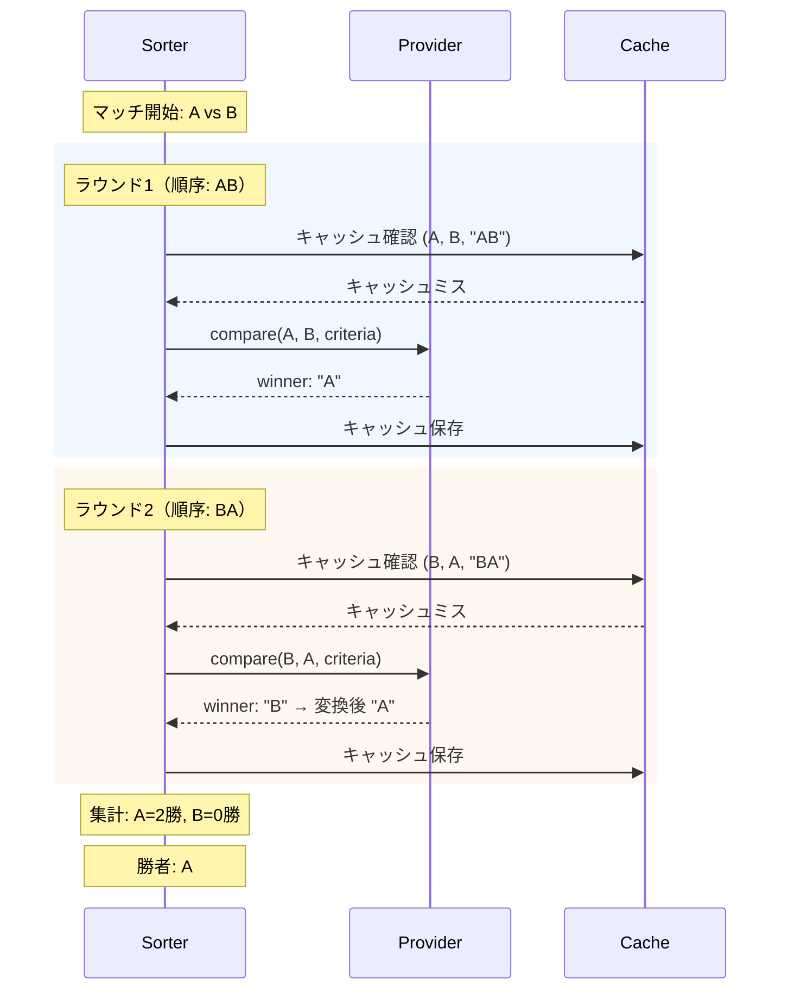
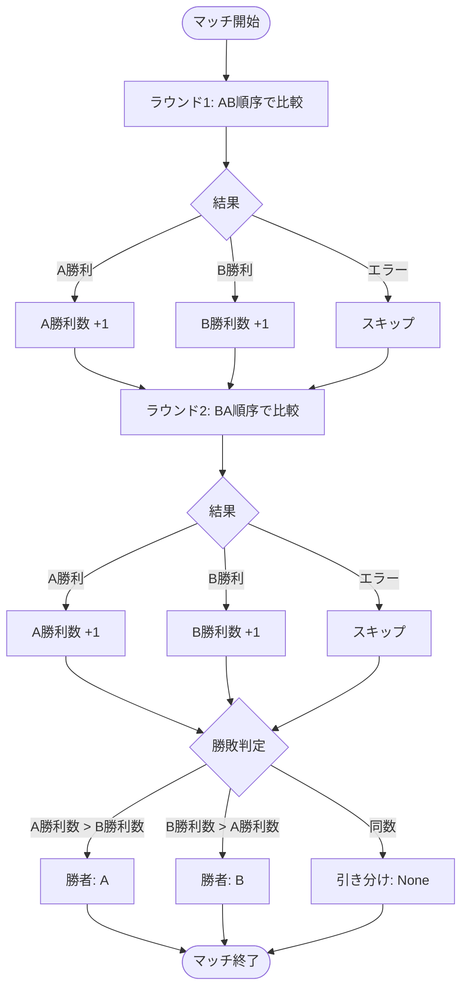
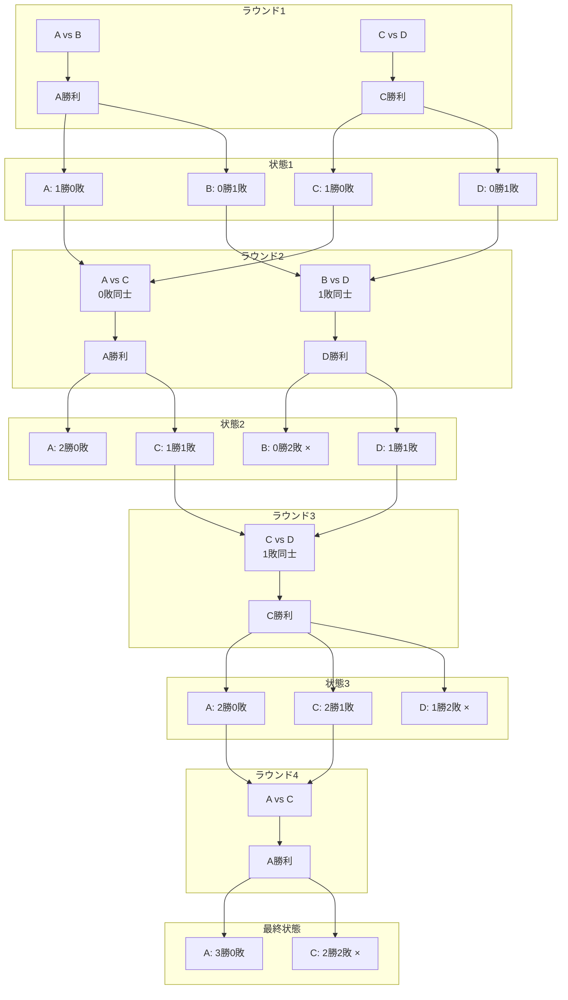
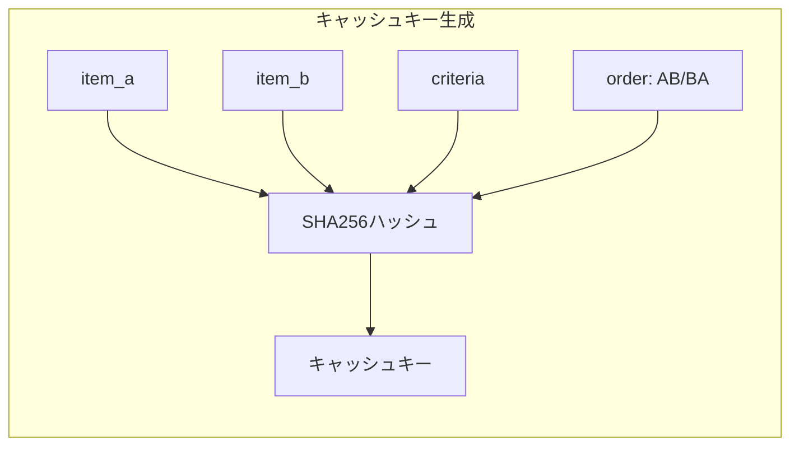
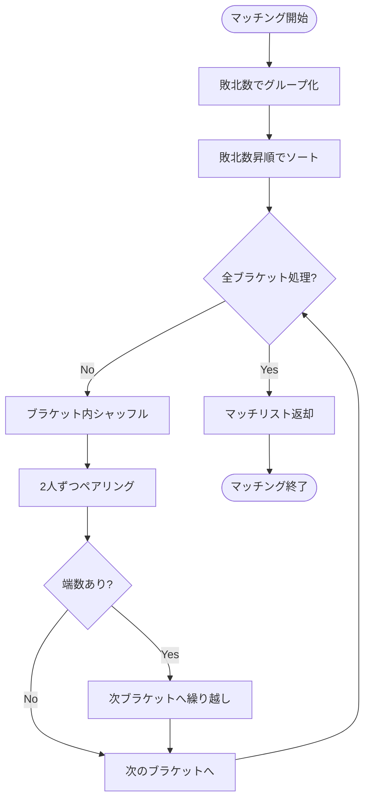

# スイス式トーナメント

## 概要

スイス式トーナメントは、参加者が指定された回数（N回）負けると脱落する方式のトーナメントです。シングルイリミネーション（1回負けで脱落）と異なり、複数回の敗北を許容することで、より公平な順位付けが可能になります。

## トーナメントの仕組み

### 基本ルール

1. 全参加者は0敗からスタート
2. 各マッチで負けると敗北数が1増加
3. 敗北数が `elimination_count` に達した参加者は脱落
4. アクティブな参加者が1人以下になるまで継続
5. 最終順位は勝利数で決定

### ブラケットシステム

参加者は敗北数によってブラケット（グループ）に分類され、同じブラケット内で優先的にマッチングされます。

## マッチの実行フロー

### 位置バイアスの軽減

LLMは提示順序によってバイアスが生じる可能性があるため、各マッチでは複数ラウンドを実行し、順序を交互に入れ替えます。

### 勝敗判定ロジック

## トーナメント進行の例

### 4アイテム、elimination_count=2 の場合

### 最終順位（勝利数順）

| 順位 | アイテム | 勝利数 | 敗北数 |
|------|----------|--------|--------|
| 1位  | A        | 3      | 0      |
| 2位  | C        | 2      | 2      |
| 3位  | D        | 1      | 2      |
| 4位  | B        | 0      | 2      |

## キャッシュキーの構造

キャッシュは比較の再利用を可能にしますが、順序バイアスを考慮して順序情報もキーに含めます。

**重要**: `compare(A, B)` と `compare(B, A)` は異なるキャッシュキーを持ちます。これにより、LLMの位置バイアスがキャッシュに正しく反映されます。

## 設定パラメータ

| パラメータ | デフォルト | 説明 |
|-----------|-----------|------|
| `elimination_count` | 2 | 脱落に必要な敗北数 |
| `comparison_rounds` | 2 | 1マッチあたりのラウンド数（偶数推奨） |
| `seed` | None | 乱数シード（再現性確保用） |

## マッチング戦略

### マッチング例

アクティブ参加者: A(0敗), B(0敗), C(0敗), D(1敗), E(1敗)

1. ブラケット0（0敗）: [A, B, C] → シャッフル → [B, A, C]
   - マッチ1: B vs A
   - 端数: C → 繰り越し
2. ブラケット1（1敗）: [D, E] + [C] → シャッフル → [E, C, D]
   - マッチ2: E vs C
   - 端数: D（対戦相手なし、次ラウンドへ）

結果: [(B, A), (E, C)]
