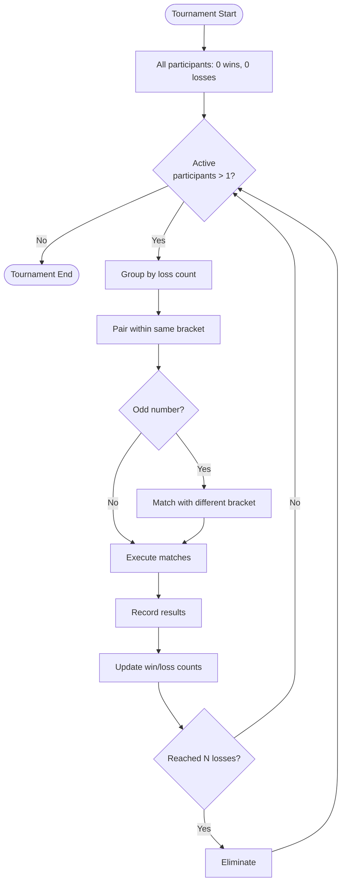
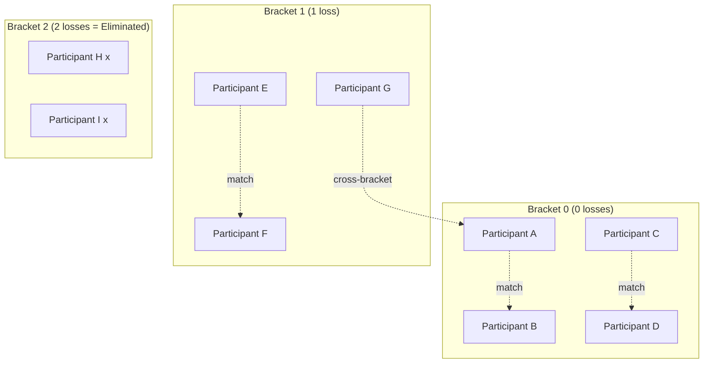
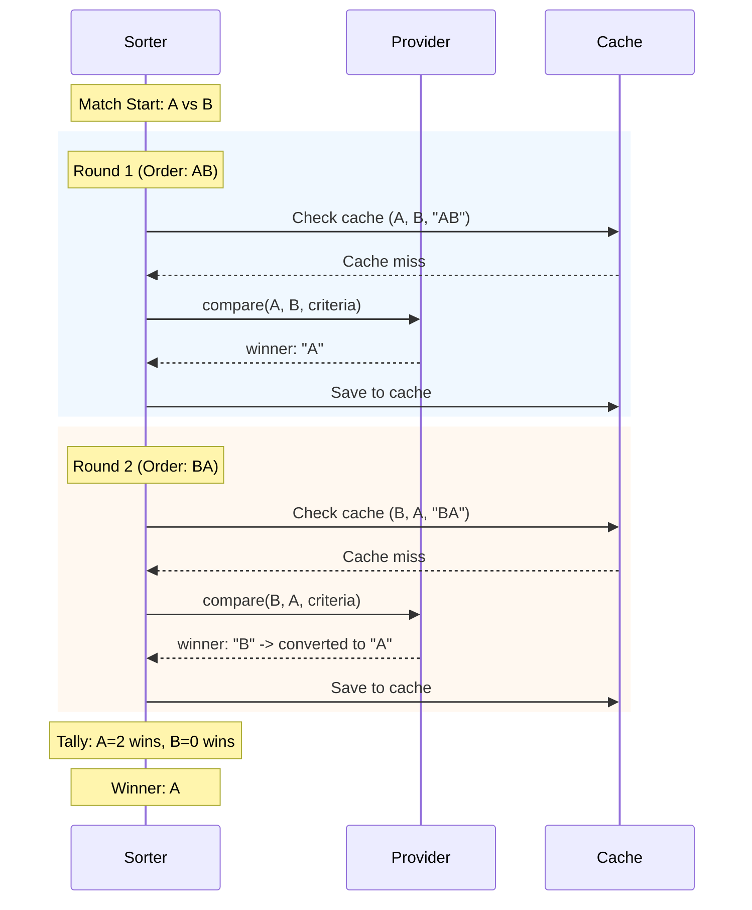
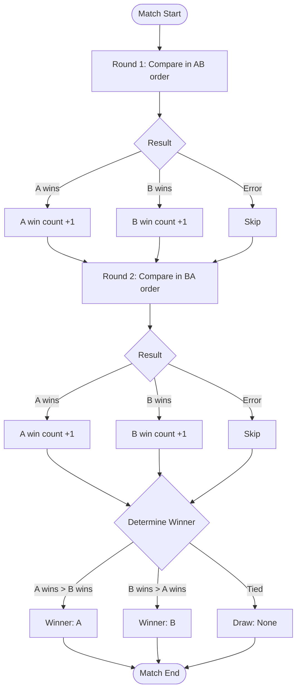
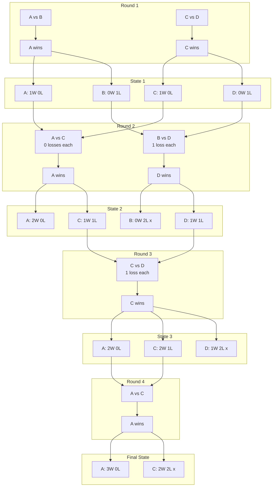
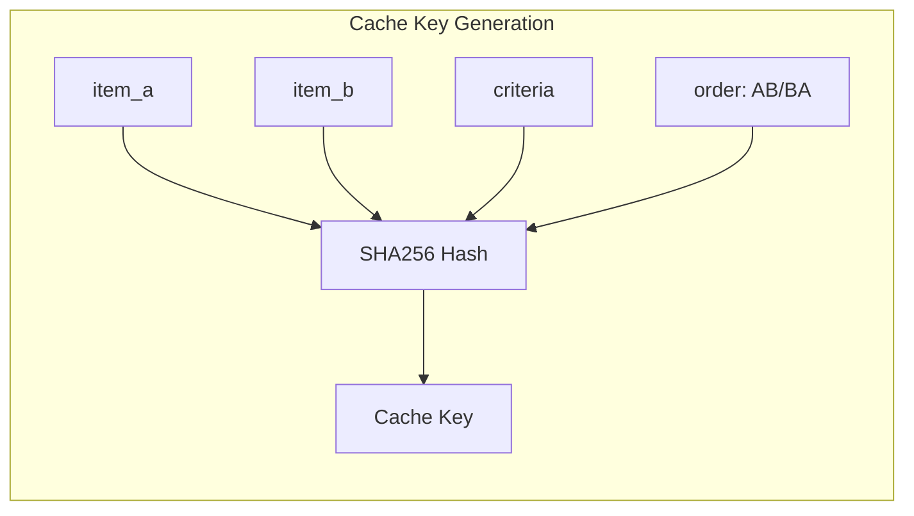
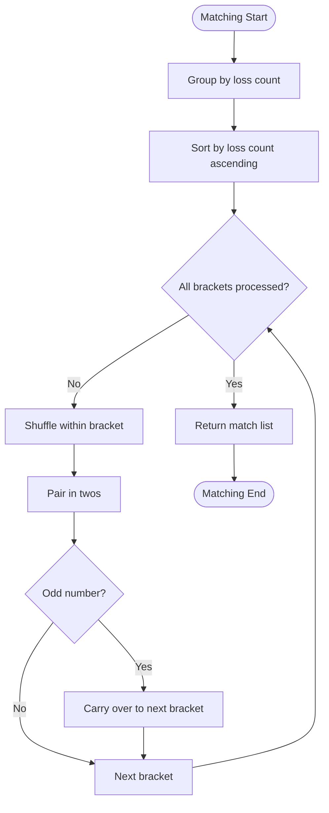

# Swiss-System Tournament

[日本語版](tournament.ja.md)

## Overview

A Swiss-system tournament is a format where participants are eliminated after losing a specified number of times (N losses). Unlike single elimination (elimination after 1 loss), allowing multiple losses enables fairer ranking determination.

## How the Tournament Works

### Basic Rules

1. All participants start with 0 losses
2. Each match loss increments the loss count by 1
3. Participants reaching `elimination_count` losses are eliminated
4. Continue until 1 or fewer active participants remain
5. Final rankings determined by win count

### Bracket System

Participants are classified into brackets (groups) based on loss count, with priority matching within the same bracket.

## Match Execution Flow

### Position Bias Mitigation

Since LLMs may exhibit bias based on presentation order, each match executes multiple rounds with alternating order.

### Win/Loss Determination Logic

## Tournament Progression Example

### 4 Items, elimination_count=2

### Final Rankings (by Win Count)

| Rank | Item | Wins | Losses |
|------|------|------|--------|
| 1st  | A    | 3    | 0      |
| 2nd  | C    | 2    | 2      |
| 3rd  | D    | 1    | 2      |
| 4th  | B    | 0    | 2      |

## Cache Key Structure

Caching enables reuse of comparisons, but order information is included in the key to account for position bias.

**Important**: `compare(A, B)` and `compare(B, A)` have different cache keys. This ensures LLM position bias is correctly reflected in the cache.

## Configuration Parameters

| Parameter | Default | Description |
|-----------|---------|-------------|
| `elimination_count` | 2 | Number of losses required for elimination |
| `comparison_rounds` | 2 | Number of rounds per match (even number recommended) |
| `seed` | None | Random seed (for reproducibility) |

## Matching Strategy

### Matching Example

Active participants: A(0 losses), B(0 losses), C(0 losses), D(1 loss), E(1 loss)

1. Bracket 0 (0 losses): [A, B, C] -> Shuffle -> [B, A, C]
   - Match 1: B vs A
   - Odd one out: C -> Carry over
2. Bracket 1 (1 loss): [D, E] + [C] -> Shuffle -> [E, C, D]
   - Match 2: E vs C
   - Odd one out: D (no opponent, wait for next round)

Result: [(B, A), (E, C)]
